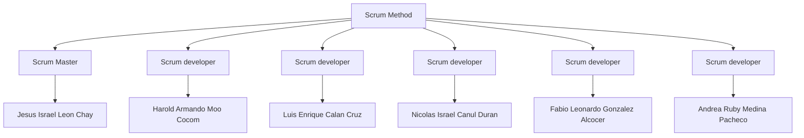

# Work Process

## Presentation

This repository houses all the planning for our project "Prototype," which is carried out by a team currently consisting of 6 members who perform certain tasks and roles in the project:

-   Jesus Israel Leon Chay. Product Owner/Scrum Master
-   Fabio Leonardo Gonzalez Alcocer. Developer
-   Andrea Ruby Medina Pacheco. Developer
-   Luis Enrique Calan Cruz. Developer
-   Nicolas Israel Canul Duran. Developer
-   Harold Armando Moo Cocom. Developer

Each role was assigned to each member primarily based on their soft skills (this is detailed more in the section [Task_Scope#5](https://github.com/Chayy80/Repostorio-Equipo-3/tree/FIS_%231_ProjectMA/Task_Scope%235)) and following the philosophy of the Belbin model.

## Repository Organization

The repository consists of several branches, which we will detail below:

1.  [main](https://github.com/Chayy80/Repostorio-Equipo-3): This is the default and main branch in the repository (it will not contain content until the end of this project).
2.  [FIS_#1_ProjectMA](https://github.com/Chayy80/Repostorio-Equipo-3/tree/FIS_#1_ProjectMA): This is the branch where all finalized and reviewed content will be stored. It will be used for the corresponding submissions.
3.  [FIS_#1_Project_Testing&Overture](https://github.com/Chayy80/Repostorio-Equipo-3/tree/FIS_%231_Project_Testing%26Overtures): This is the testing branch where all team members will place their activities and assign their "pull requests" for testing. It is almost a mirror of the previous branch, intended for experimentation without affecting the submission branch and avoiding errors.
4.  FIS#1_PB_****: These are the personal branches, identified by the term PB (Personal Branch) and the name of the collaborator to whom it belongs. Each member does their work and assignments here.

Each of these branches contains their respective folders, starting with the name "Task," plus the Readme of each branch, which explains the purpose of that branch.

##### *PD 1 and PD2 are just a branches for submitting a task and is not an essential part of the project.

## Activities and Assignments

Each collaborator was assigned a personalized number of tasks depending on their skills and availability, with the goal of completing the project on time. The assigned tasks were:

Weight of the activity: Red: 40 points, Orange: 30-25 points, Yellow: 15 \-10 points.  
The number of points earned is the corresponding percentage grade number that will be converted to a percentage. Example: 100 points \- 100% grade

The activities are in our backlog and you can check it in our project of github

\*Nomenclature in the backlog: T\#\_PB.\#-\#. The (T\#) is the number of the carpet of the task, and the number of integrant and the number of activity

Table of the activities

| Activities | Integrant | Weight | Done? |
| :---- | :---- | :---- | :---- |
| PB.01-1 | 01 | Red | Yes |
| PB.01-2 | 01 | Orange | Yes |
| PB.01-3 | 01 | Yellow | Yes |
| PB.01-4 | 01 | Yellow | Yes |
| PB.02-1 | 02 | Red | Yes |
| PB.02-2 | 02 | Orange | Yes |
| PB.02-3 | 02 | Yellow | Yes |
| PB.02-4 | 02 | Yellow | Yes |
| PB.03-1 | 03 | Red | Don’t for him |
| PB.03-2 | 03 | Orange | Don’t for him |
| PB.04-1 | 04 | Red | Yes |
| PB.04-2 | 04 | Orange | Yes |
| PB.04-3 | 04 | Yellow | Yes |
| PB.04-4 | 04 | Yellow | Yes |
| PB.05-1 | 05 | Red | Yes |
| PB.05-2 | 05 | Orange | Yes |
| PB.05-3 | 05 | Yellow | Yes |
| PB.05-4 | 05 | Yellow | Yes |
| PB.06-1 | 06 | Red | Yes |
| PB.06-2 | 06 | Orange | Yes |
| PB.06-3 | 06 | Orange | Yes |
 
## Meetings

It was agreed that meetings would be held in a mixed format (in-person or virtual). In-person meetings were held every Friday from 9 to 10:30, with the final meeting on Monday, October 30, which is the final submission date for this phase. Virtual meetings were held on Discord on agreed-upon days. For more information, consult the [blog](https://github.com/users/Chayy80/projects/1).

## Individual Contribution Metric

After establishing the roles, the tasks to be completed, and scheduling the meetings in the log, the work was divided so that each person could complete tasks individually or in collaboration with others (more details in our GitHub project [FIS_Project](https://github.com/users/Chayy80/projects/1)). The collaborators completed their three activities on time and remained active in the project, aiming to achieve a 100% score for this submission. No issues arose in this phase, but if any should arise, they will be addressed in one of the in-person or virtual meetings, and appropriate measures will be taken by the team.

This approach is adopted to accommodate the circumstances of each collaborator and avoid using a rigid metric. In cases like a slight delay in submitting a task, it is not deemed appropriate to reduce the score percentage; instead, the collaborator will be warned to be more careful in the future. If it happens again, more serious measures will be taken.

Table of the Individual contribution metric:

| Integrante | Actividad 1 (Red) | Actividad 2 (Orange) | Activity 3 (Orange) | Activity 4 (Yellow) | Activity 5 (Yellow) | Total |
| :---- | :---- | :---- | :---- | :---- | :---- | :---- |
| 01 | 40 pts | 25 pts | don’t | 15 pts | 15 pts | 95% |
| 02 | 40 pts | 25 pts | 25 pts | 10 pts | don’t | 100% |
| 03 | 0 pts | 0 pts | don’t | don’t | don’t | 0% |
| 04 | 40 pts | 30 pts | don’t | 15 pts | 15 pts | 100% |
| 05 | 40 pts | 30 pts | don’t | 15 pts | 15 pts | 100% |
| 06 | 40 pts | 30 pts | 30 pts | don’t  | don’t | 100% |
