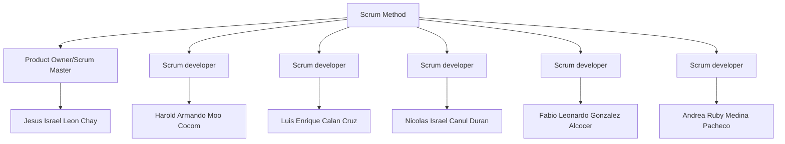

# Work Process

## Presentation

This repository houses all the planning for our project "Prototype," which is carried out by a team currently consisting of 6 members who perform certain tasks and roles in the project:

-   Jesus Israel Leon Chay. Product Owner/Scrum Master
-   Fabio Leonardo Gonzalez Alcocer. Developer
-   Andrea Ruby Medina Pacheco. Developer
-   Luis Enrique Calan Cruz. Developer
-   Nicolas Israel Canul Duran. Developer
-   Harold Armando Moo Cocom. Developer

Each role was assigned to each member primarily based on their soft skills (this is detailed more in the section [Task_Scope#5](https://github.com/Chayy80/Repostorio-Equipo-3/tree/FIS_%231_ProjectMA/Task_Scope%235)) and following the philosophy of the Belbin model.

## Repository Organization

The repository consists of several branches, which we will detail below:

1.  [main](https://github.com/Chayy80/Repostorio-Equipo-3): This is the default and main branch in the repository (it will not contain content until the end of this project).
2.  [FIS_#1_ProjectMA](https://github.com/Chayy80/Repostorio-Equipo-3/tree/FIS_#1_ProjectMA): This is the branch where all finalized and reviewed content will be stored. It will be used for the corresponding submissions.
3.  [FIS_#1_Project_Testing&Overture](https://github.com/Chayy80/Repostorio-Equipo-3/tree/FIS_%231_Project_Testing%26Overtures): This is the testing branch where all team members will place their activities and assign their "pull requests" for testing. It is almost a mirror of the previous branch, intended for experimentation without affecting the submission branch and avoiding errors.
4.  FIS#1_PB_****: These are the personal branches, identified by the term PB (Personal Branch) and the name of the collaborator to whom it belongs. Each member does their work and assignments here.

Each of these branches contains their respective folders, starting with the name "Task," plus the Readme of each branch, which explains the purpose of that branch.

##### *PD 1 and PD2 are just a branches for submitting a task and is not an essential part of the project.

## Activities and Assignments

Each collaborator was assigned a personalized number of tasks depending on their skills and availability, with the goal of completing the project on time. The assigned tasks were:

Weight of the activity: Red: 40 points, Orange: 30-25 points, Yellow: 15 \-10 points.  
The number of points earned is the corresponding percentage grade number that will be converted to a percentage. Example: 100 points \- 100% grade

The activities are in our backlog and you can check it in our project of github

\*Nomenclature in the backlog: PB.\#-\#. The PB.##-# is the number of integrant and the number of activity

Table of the activities

| Activities | Integrant | Weight | Done? |
| :---- | :---- | :---- | :---- |
| PB.01-1 | 01 | Red | Yes |
| PB.01-2 | 01 | Orange | Yes |
| PB.01-3 | 01 | Yellow | Yes |
| PB.01-4 | 01 | Yellow | Yes |
| PB.02-1 | 02 | Red | Yes |
| PB.02-2 | 02 | Orange | Yes |
| PB.02-3 | 02 | Yellow | Yes |
| PB.02-4 | 02 | Yellow | Yes |
| PB.04-1 | 04 | Red | Yes |
| PB.04-2 | 04 | Orange | Yes |
| PB.04-3 | 04 | Yellow | Yes |
| PB.04-4 | 04 | Yellow | Yes |
| PB.05-1 | 05 | Red | Yes |
| PB.05-2 | 05 | Orange | Yes |
| PB.05-3 | 05 | Yellow | Yes |
| PB.05-4 | 05 | Yellow | Yes |
| PB.06-1 | 06 | Red | Yes |
| PB.06-2 | 06 | Orange | Yes |
| PB.06-3 | 06 | Orange | Yes |
 
## Meetings

It was agreed that meetings would be held in a mixed format (in-person or virtual). In-person meetings were held every Friday from 9 to 10:30, with the final meeting on Monday, October 04, which is the final submission date for this phase. Virtual meetings were held on Discord on agreed-upon days. For more information, consult the [blog](https://github.com/users/Chayy80/projects/1).

## Individual Contribution Metric

After establishing the roles, the tasks to be completed, and scheduling the meetings in the log, the work was divided so that each person could complete tasks individually or in collaboration with others (more details in our GitHub project [FIS_Project](https://github.com/users/Chayy80/projects/1)). The collaborators completed their three activities on time and remained active in the project, aiming to achieve a 100% score for this submission. No issues arose in this phase, but if any should arise, they will be addressed in one of the in-person or virtual meetings, and appropriate measures will be taken by the team.

This approach is adopted to accommodate the circumstances of each collaborator and avoid using a rigid metric. In cases like a slight delay in submitting a task, it is not deemed appropriate to reduce the score percentage; instead, the collaborator will be warned to be more careful in the future. If it happens again, more serious measures will be taken.

Table of the Individual contribution metric:

| Integrante | Actividad 1 (Red) | Actividad 2 (Orange) | Activity 3 (Orange) | Activity 4 (Yellow) | Activity 5 (Yellow) | Total |
| :---- | :---- | :---- | :---- | :---- | :---- | :---- |
| 01 | 40 pts | 30 pts | don’t | 15 pts | 15 pts | 100% |
| 02 | 40 pts | 25 pts | 25 pts | 10 pts | don’t | 100% |
| 03 |  |  |  |  |  | 0% |
| 04 | 40 pts | 30 pts | don’t | 15 pts | 15 pts | 100% |
| 05 | 40 pts | 30 pts | don’t | 15 pts | 15 pts | 100% |
| 06 | 40 pts | 30 pts | 30 pts | don’t  | don’t | 100% |

# Step by Step about our process

## Problematic

First we started thinking about a problem that we had at school level, at first we were thinking about making a change in the system of choice of subjects, but we did not have the resources to do this, then we realized that between tutors and students there is always a lack of interest of the latter to make an appointment with them to talk to each other, with that problem we decided to work and find a solution that was to create Class Hub, a messaging system that would streamline communication between these two parties. That was the idea and solution in mind, now it was a matter of working out how ClassHub would do it.

## Requeriments

With this we started now to plan the functional and non-functional requirements that our product had to meet, we started establishing requirements such as a login, messaging system, file saving system, among others but we realized with the first delivery that the list we delivered was too long, so we decided to cut requirements that were not entirely necessary and even some that we did not realize that they were repeated, they lacked specification.
and many details that we were correcting with the passing of the deliveries.
With these points explained and the requirements refined, we wrote the user story format from the beginning, until we got to the ones we have in this final delivery. We also made the analysis of the acceptance criteria for each user story.

## Metodology

With this done, the only thing left to do was to start organizing the team and see where we were going to house all the progress of our work. At the beginning, the work methodology that we tried to apply was the waterfall method but due to the lack of time it was not going to allow us to work properly if we used this methodology. With what we learned from the course and with the amount of time that was too little to apply this method we had to migrate to Scrum, an agile methodology that actually turned out to be very friendly for us because it benefits a lot to maintain a good and constant communication with your team members, something that we did have because we always had constant meetings and we implemented a backlog for the constant review of the tasks and requirements for the work.
Although the team constantly communicated every change and event, sometimes this failed and was not properly notified, as well as there were constant problems when it came to discipline when applying the sprints, we all worked properly, but we could have improved around delivery times.

## Wireframes

After having already established the requirements sufficiently refined we started working on the wireframes, which would give them the structure that was necessary to see how our product would be composed, we started working in penpont and did everything from scratch but we made the mistake of creating UI's, we focused a lot on visual design, then with more knowledge of what a wireframe was we decided to use an internet toolkit with which we would take the most important elements and switched to Figma, as this was more practical when working on a toolkit in our opinion. We first made the login and chat wireframes which were to be created with respect to the requirements, this with the plan to start getting familiar with Figma, after that we went on with the rest of the wireframes, until we came to our senses and we had to mainly make the wireframes of the requirements that form the innovative part of ClassHub, shifting our focus and energies to this goal.

## UI

For the UI's the truth is that the work we did on the wireframes was faithful enough to work on them the animations we would need for the simulation.  The animations were what really complicated us, making the wireframes was only as such the process copy, paste, modify, it was relatively easy, time consuming, but not very complex, now, create the flow where the user would have to interact with each component of our UI's that was not easy because we did not have to follow directly the Happy Path, this route was made first and we seek in the design of the UI's that is intuitive for the user and only have to follow this route. 

## Usability Test

A la hora de las pruebas de usabilidad, empezamos a conseguir las metricas que nos proporcionaban nuestros UI’s, decidimos usar Google Forms para el registro de los datos y grabamos la conversación que se tuvieron con nuestros 5 sujetos, los datos a los que llegamos no fueron lo completamente esperado, pensabamos que al hacer UI’s sencillos donde los usuarios seguirian el Happy Path debido a su limitadas opciones, pero no contamos con que los usuarios se agobiarian y a veces decidieran volver al menú, contamos el número de equivocaciones, numero de click, etc. Al final los resultados de la prueba no buscaban ser satisfactorios, buscabamos ver como era el trabajo que habiamos realizado.

